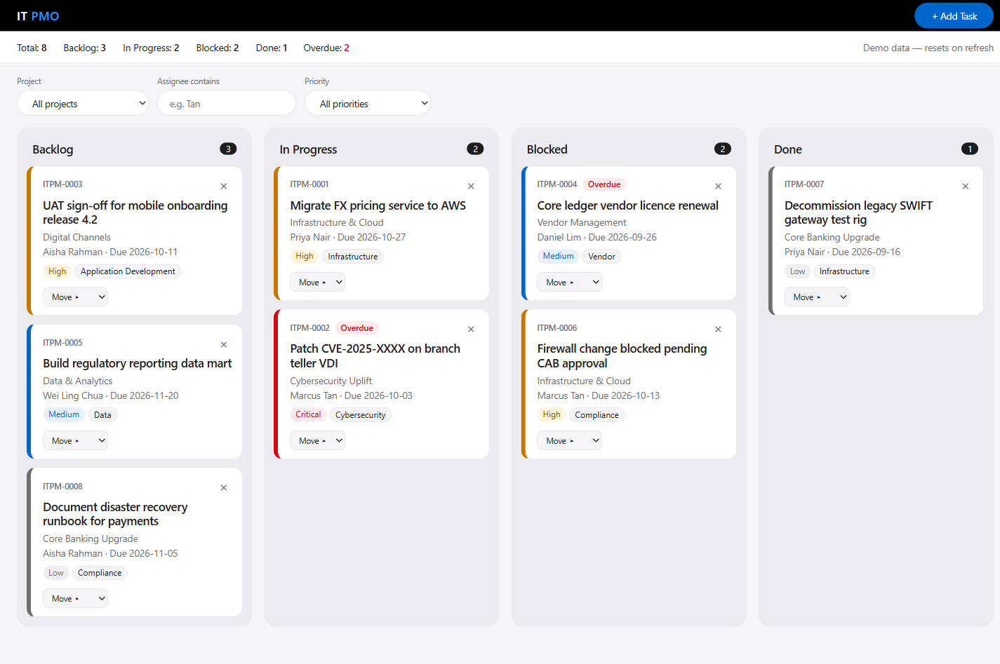

# IT PMO Kanban

A single-file Kanban board demo for a fictitious bank's IT PMO team. Vanilla HTML, CSS and JS.

**Live demo:** https://aryanenggaHub.github.io/kanban5/

[](https://github.com/aryanenggaHub/kanban5/actions/workflows/ci-cd.yml)



## Features

- Board with task cards grouped by status column, with per-column counts
- Summary counts across all tasks (unaffected by filters)
- Add Task modal with form validation and success toast
- Move tasks between columns by drag and drop or the "Move ▸" select (keyboard friendly)
- Delete with inline confirmation
- Filters over the visible tasks
- Priority badges and an Overdue flag (seed due dates are relative to today)
- Optional email notification on new task via FormSubmit (failure shows a warning toast and never breaks the board)

## Run

Open `index.html` in a browser. No build, no server, no package manager.

## Constraints

- One file, no frameworks, CDN, fonts or images, and no `!important`
- No storage APIs: refreshing resets the board to the seed data (the UI says so)
- No real bank branding: wordmark is "IT PMO", task IDs are `ITPM-####`
- The only network call is the FormSubmit notification; set `FORMSUBMIT_ENDPOINT` in `index.html` to your own address (needs one-time FormSubmit activation)

## Structure

```
index.html                  the whole app
DESIGN.md                   visual language
CLAUDE.md                   guidance for Claude Code
docs/superpowers/           spec and implementation plan
.github/workflows/ci-cd.yml checks and GitHub Pages deploy
```
