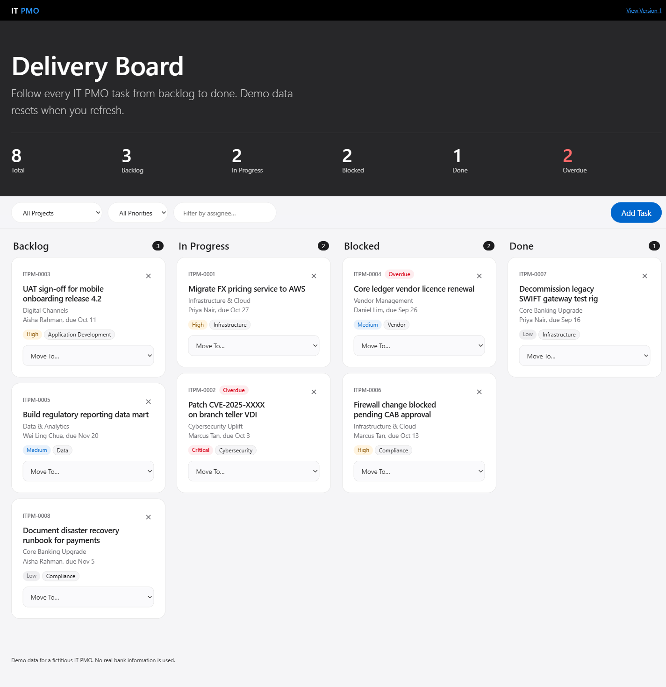

# IT PMO Kanban

A single-file Kanban board demo for a fictitious bank's IT PMO team. Vanilla HTML, CSS and JS.

**Live demo:**
- Version 2 (redesign): https://aryanenggaHub.github.io/kanban5/v2/
- Version 1 (original): https://aryanenggaHub.github.io/kanban5/

[](https://github.com/aryanenggaHub/kanban5/actions/workflows/ci-cd.yml)



## Version 2

A redesign in [v2/index.html](v2/index.html) that follows [DESIGN.md](DESIGN.md): a dark hero tile with the summary, a frosted sticky tool bar, and flat white task cards. Same features as version 1, plus:

- Pure board core (`createBoard`) with 17 tests, run by `node --test v2/board.test.mjs`
- Filters kept in the URL, so a filtered board can be shared
- Native `<dialog>` for Add Task, with focus handling from the browser
- Content Security Policy that allows only the FormSubmit request
- Responsive from phone to wide desktop, keyboard and reduced-motion friendly

Version 1 (below, screenshot in `docs/screenshot.png`) stays live and unchanged.

## Features

- Board with task cards grouped by status column, with per-column counts
- Summary counts across all tasks (unaffected by filters)
- Add Task modal with form validation and success toast
- Move tasks between columns by drag and drop or the "Move ▸" select (keyboard friendly)
- Delete with inline confirmation
- Filters over the visible tasks
- Priority badges and an Overdue flag (seed due dates are relative to today)
- Optional email notification on new task via FormSubmit (failure shows a warning toast and never breaks the board)

## Run

Open `index.html` (version 1) or `v2/index.html` (version 2) in a browser. No build, no server, no package manager. Tests need only Node: `node --test v2/board.test.mjs`.

## Constraints

- One file, no frameworks, CDN, fonts or images, and no `!important`
- No storage APIs: refreshing resets the board to the seed data (the UI says so)
- No real bank branding: wordmark is "IT PMO", task IDs are `ITPM-####`
- The only network call is the FormSubmit notification; set `FORMSUBMIT_ENDPOINT` in `index.html` to your own address (needs one-time FormSubmit activation)

## Structure

```
index.html                  version 1, the whole app
v2/index.html               version 2, the whole app (core + page)
v2/board.test.mjs           tests for the version 2 board core
GLOSSARY.md                 domain terms
DESIGN.md                   visual language
CLAUDE.md                   guidance for Claude Code
docs/adr/                   architecture decisions
docs/superpowers/           spec and implementation plan
.github/workflows/ci-cd.yml checks and GitHub Pages deploy
```
